# Solarized Matrix — Brutalist macOS Screensaver

A Solarized-dark, brutalist, matrix-rain screensaver for macOS. Half-width
katakana and a JS/TS engineering glyph set; bright base3 head glyph; Solarized
accent colour-per-column.

## Preview

<p align="center">
  
</p>

> The clip above is **not a video file** — it's a self-contained animated SVG
> (`assets/matrix-preview.svg`): vector glyphs driven by SMIL animation, which
> GitHub renders and loops inline. It mirrors the palette and glyph set from
> `MatrixView.swift`. Regenerate it with `mise run preview` — or directly,
> `python3 tools/gen_preview.py > assets/matrix-preview.svg`. It's an
> *impression* of the look, not a frame-exact capture — the real thing runs at
> 30 fps with longer, glowing trails.

## What's here

| File | Purpose |
|------|---------|
| `MatrixView.swift` | The entire screensaver — single `ScreenSaverView` subclass. The source of truth for the look. |
| `build/SolarizedMatrix.saver/` | Bundle skeleton (`Info.plist` + `MacOS/`). Rebuild the binary from source. |
| `assets/matrix-preview.svg` | The animated preview shown above. Generated, not hand-edited. |
| `tools/gen_preview.py` | Generator for the preview SVG (`mise run preview`); mirrors the look from `MatrixView.swift`. |
| `README.md` | This file — palette reference + build/install steps. |

Tunables live in the `Cfg` struct at the top of `MatrixView.swift` — glyph cell
size, fall speed, trail fade, and the logo size/alpha are all there.

## Solarized Dark palette

```
base03  #002b36   background        cyan    #2aa198
base02  #073642                     blue    #268bd2
base01  #586e75   borders/dim       green   #859900
base0   #839496   body              violet  #6c71c4
base1   #93a1a1   bright            yellow  #b58900
base3   #eee8d5   bright head glyph orange  #cb4b16
                                    red     #dc322f
                                    magenta #d33682
```

Column glyphs cycle through cyan → blue → green → violet → yellow; the leading
"head" glyph is base3 (`#eee8d5`) for the classic bright-tip matrix look.

## Installing the pre-built release

Download `SolarizedMatrix.saver.zip`, unzip, then double-click `SolarizedMatrix.saver` to install.

**"App is damaged" / Gatekeeper warning?**  
macOS tags files downloaded from the internet with a quarantine attribute and blocks unsigned bundles. Fix it with one command after installing:

```bash
xattr -cr ~/Library/Screen\ Savers/SolarizedMatrix.saver
```

Then open System Settings ▸ Screen Saver and pick **SolarizedMatrix**.

**Prefer to avoid the workaround?** Clone the repo and build it yourself (see section below) — locally-built bundles are never quarantined.

---

## Building the .saver (no Xcode required)

### With mise (recommended)

[mise](https://mise.jdx.dev) wraps the reproducible steps as tasks:

```bash
mise run build      # compile + ad-hoc sign          -> build/SolarizedMatrix.saver
mise run install    # build, then install to ~/Library/Screen Savers and reload
mise run package    # build, then zip a distributable -> SolarizedMatrix.saver.zip
```

Set the version in one place — `SM_VERSION` in `mise.toml` — and it's stamped into
the generated `Info.plist`. Cutting a full GitHub release is documented in the
`release` skill under `.claude/skills/release/`.

### By hand

The same underlying steps (`mise.toml` is the authoritative version — notably it
also generates `Contents/Info.plist`, which the bundle needs in order to load):

```bash
mkdir -p build/SolarizedMatrix.saver/Contents/MacOS

swiftc MatrixView.swift \
  -module-name SolarizedMatrix \
  -emit-library -Xlinker -bundle \
  -o build/SolarizedMatrix.saver/Contents/MacOS/SolarizedMatrix \
  -framework ScreenSaver -framework AppKit -framework Foundation \
  -target arm64-apple-macosx13.0

codesign -s - build/SolarizedMatrix.saver

cp -r build/SolarizedMatrix.saver ~/Library/Screen\ Savers/
killall legacyScreenSaver 2>/dev/null; killall ScreenSaverEngine 2>/dev/null
```

Verify the output is a **bundle**, not a dylib — macOS will refuse to run a
screensaver built as a shared library:

```bash
file build/SolarizedMatrix.saver/Contents/MacOS/SolarizedMatrix
# → Mach-O 64-bit bundle arm64
```

### Activating (macOS 26 Tahoe)

Screen Saver settings moved: **System Settings → Wallpaper → Screen Saver… → toggle to Custom** → select **SolarizedMatrix**.

On earlier macOS versions: **System Settings → Screen Saver**.

Note: macOS runs screensavers out of process (`legacyScreenSaver`). If a build
doesn't refresh, log out/in or run `killall legacyScreenSaver`.

### Xcode (optional)

If you prefer an Xcode project: **File ▸ New ▸ Project ▸ macOS ▸ Screen Saver** → name it `SolarizedMatrix`, replace the generated view with `MatrixView.swift`, set **Principal class** to `SolarizedMatrix.MatrixView`, and build.

## Open design choices

- **Glyphs**: currently katakana + code symbols mixed. Switch to pure katakana or pure code by editing the glyph set.
- **Brutalist overlay**: a hard border frame, big mono wordmark, clock, and scanlines would round out the look. The Swift port renders rain + logo ghost rain only — adding the overlay (text + frame + scanlines) is the natural next step.
- **Config sheet**: `hasConfigureSheet` is `false`. Add a sheet to expose speed/colors at runtime if wanted.
- **Multi-display**: ScreenSaverView handles this, but test per-monitor sizing.
